# CSE 258 Assignment 1 Report

## Purchase Prediction

### Algorithm Description

A simple predictor that return 1 if the user has purchased same category before, Otherwise return 0.

```python
def predictor(u, i):
    try:
        reviewer_pair = reviewer_category_pair[u]
        item_pair = item_category_pair[i]
    except KeyError:
        return 0

    for i in item_pair:
        if i in reviewer_pair: return 1
    return 0
```

### Result
#### Public leaderboard
Ranking: 676/816  Score: 0.63549
#### Private leaderboard
Ranking: 729/816  Score: 0.63414

### Comment
I also experimented K-nearest-neighbors (cosine similarity) and predict based on how many neighbors has purchased this item. But this doesn't give better result than the simple predictor above.

## Rating Prediction

### Algorithm Description

I use Latent Factor model (Matrix Factorization) for this task. Because the size of users and items is very large, its difficult to directly perform gradient descent on the large users-items rating matrix. The model apply two small matrix P and Q to approximate the large matrix by performing matrix multiplication on P and Q. The estimated rating of item i given by user u is calculated by:<br>
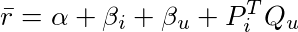
<!---
\bar{r} = \alpha + \beta_i + \beta_u + P_i^TQ_u
-->

The implementation of matrix factorization is modified from Albert Au Yeung's [blog post](http://www.albertauyeung.com/post/python-matrix-factorization/)

### Loss Function
The loss function is defined by the sum of difference of true rating and estimated rating, plus regularization. 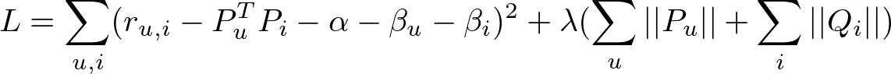
<!---
L = \sum_{u,i}(r_{u,i} - P_u^T P_i - \alpha - \beta_u - \beta_i)^2 + \lambda(\sum_u ||P_u|| + \sum_i||Q_i||)
-->


```python
def mse(self):
    """
    A function to compute the total mean square error
    """
    xs, ys = self.R.nonzero()
    predicted = self.full_matrix()
    error = 0
    for x, y in zip(xs, ys):
        error += pow(self.R[x, y] - predicted[x, y], 2)
    return np.sqrt(error)
```


#### Gradient Descent Update
The model would update bias term a, b_u, b_i and matrix P, Q on every training data.

1. Bias term
    - Calculate the derivative of a, b_u, b_i by
    <br>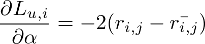
    <br>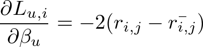
    <br>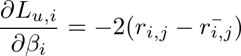

    - Then update b_u, b_i by
    <br>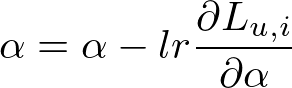
    <br>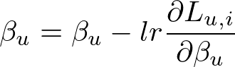
    <br>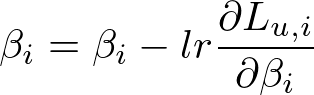

<!---
\frac{\partial L_{u,i}}{\partial \alpha} = -2(r_{i,j} - \bar{r_{i,j}})
\frac{\partial L_{u,i}}{\partial \beta_{u}} = -2(r_{i,j} - \bar{r_{i,j}})
\frac{\partial L_{u,i}}{\partial \beta_{i}} = -2(r_{i,j} - \bar{r_{i,j}})

\alpha = \alpha - lr \frac{\partial L_{u,i}}{\partial \alpha}
\beta_{u} = \beta_{u} - lr \frac{\partial L_{u,i}}{\partial \beta_{u}}
\beta_{i} = \beta_{i} - lr \frac{\partial L_{u,i}}{\partial \beta_{i}}
-->


2. Matrix P, Q
    - Calculate the derivative of P, Q by
<br>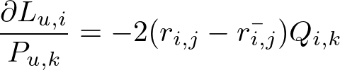
<br>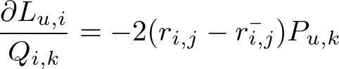

    Then update P and Q by
<br>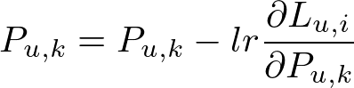
<br>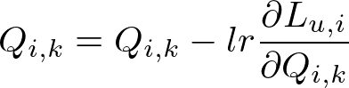

<!---
\frac{\partial L_{u,i}}{P_{u,k}} = -2(r_{i,j} - \bar{r_{i,j}})Q_{i,k}
\frac{\partial L_{u,i}}{Q_{i,k}} = -2(r_{i,j} - \bar{r_{i,j}}){P_{u,k}}

P_{u,k} = P_{u,k} - lr \frac{\partial L_{u,i}}{\partial P_{u,k}}
Q_{i,k} = Q_{i,k} - lr \frac{\partial L_{u,i}}{\partial Q_{i,k}}
-->

```python
def sgd(self):
    """
    Perform stochastic graident descent
    """
    for i, j, r in self.samples:
        # Computer prediction and error
        prediction = self.get_rating(i, j)
        e = (r - prediction)

        # Update biases
        alpha += 2 * self.lr1 * e
        self.b_u[i] += 2 * self.lr1 * e
        self.b_i[j] += 2 * self.lr1 * e

        # Update user and item latent feature matrices
        self.P[i, :] += 2 * self.lr2 * (e * self.Q[j, :])
        self.Q[j, :] += 2 * self.lr2 * (e * self.P[i, :])
```
#### Predictor
1. If the user and item both not in the dataset, return average rating of all items.
2. If user (or item) not in the dataset, return average rating of this item (or user).
3. Otherwise, return the predict rating calculated by
 

```python
def predictor(u, i):
    if u not in RA.user2index and i not in RA.item2index:
        return RA.all_avg
    if u not in RA.user2index:
        return sum([r for u,r in RA.item2user[i]]) / len(RA.item2user[i])
    if i not in RA.item2index:
        return sum([r for u,r in RA.user2item[u]]) / len(RA.user2item[u])

    user_index = RA.user2index[u]
    item_index = RA.item2index[i]
    r = mfa.get_rating(user_index, item_index)
    if r > 5:
        r = 5
    elif r < 0:
        r = 0
    return r
```

### Result
#### Public leaderboard
Ranking: 442/461  Score: 1.19568
#### Private leaderboard
Ranking: 439/461  Score: 1.17019

### Comment
I experimented various K (size of latent variables) 10, 20, 50, 100, 500. K=50 has the best performance in validation set and I use it in my submission.
